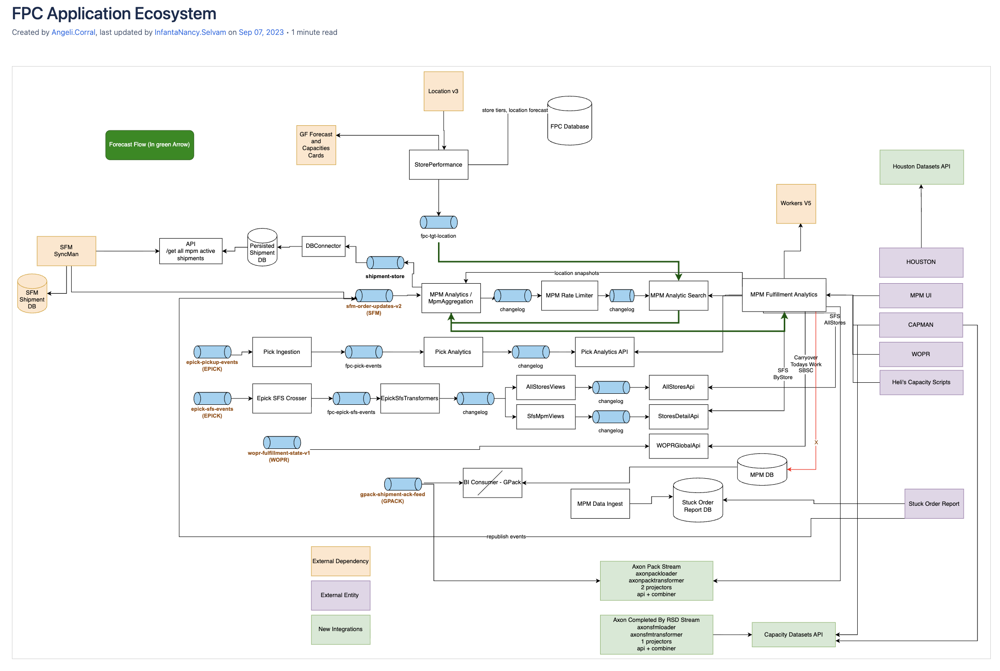
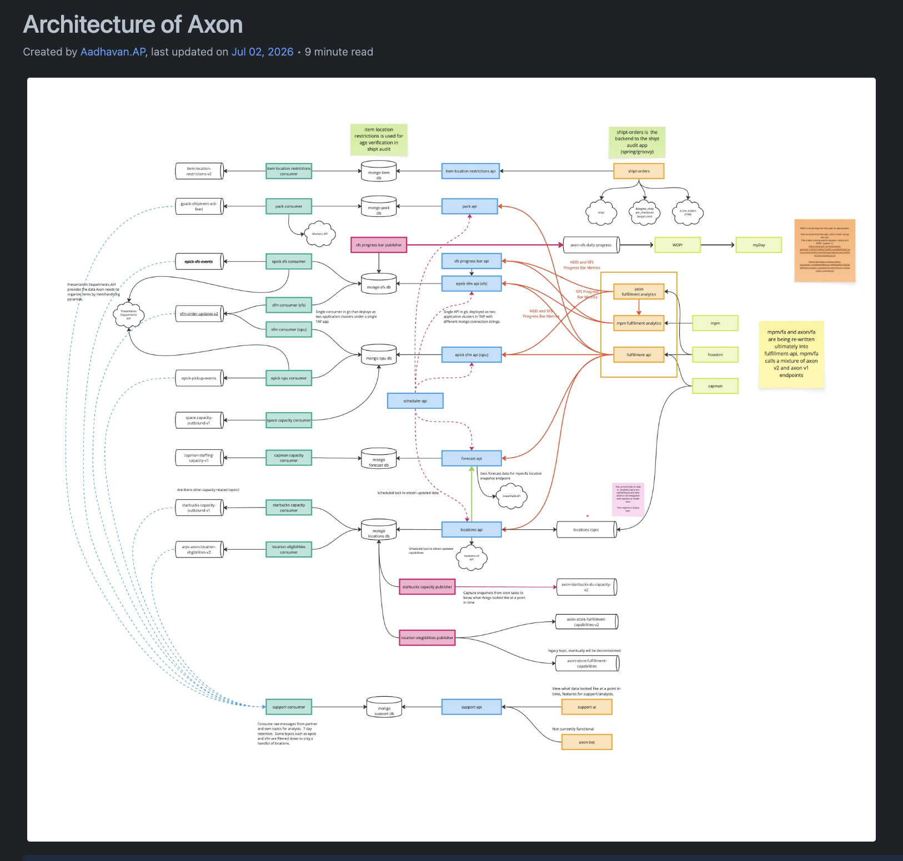

# Abdul Ashwood - Profile and Body of Work

## Table of Contents

- [Abdul Ashwood - Profile and Body of Work](#abdul-ashwood---profile-and-body-of-work)
    - [Introduction](#introduction)
    - [Responsibilities](#responsibilities)
    - [Major Projects at Target](#major-projects-at-target)
        - [Legacy Framework Modernization (FPC → Axon)](#legacy-framework-modernization-fpc--axon)
        - [Config-Scripts JSON → Kotlin Rebuild](#config-scripts-json--kotlin-rebuild)
        - [Multi-Routing & Order Batching](#multi-routing--order-batching)
        - [GitHub Migration Automation](#github-migration-automation)
    - [Product Performance and Stability](#product-performance-and-stability)
    - [Collab at Target](#collab-at-target)
        - [Pull Requests](#pull-requests)
        - [Innovative Ideas](#innovative-ideas)
            - [Produce Team Slack-Bot](#produce-team-slack-bot)
            - [Automated Code Refactoring Processors](#automated-code-refactoring-processors)
    - [Presentations & Demos](#presentations--demos)
    - [Development Work Examples](#development-work-examples)
    - [Mentorship & Leadership](#mentorship--leadership)
    - [Recommendations and Recognitions](#recommendations-and-recognitions)
    - [Technical Skill Set](#technical-skill-set)
    - [References](#references)

## Introduction
I am a Software Engineer at Target Corp, where I have worked since June 2019. 
I began my career here through the Target Leadership Program (TLP) after graduating with a B.S. 
in Computer Science from North Carolina Agricultural & Technical State University, 
and prior to Target I interned as a Software Developer at IBM.

My journey at Target started as a TLP, 
where I quickly ramped up on the company's core services building an API to learn our Kafka, MongoDB, and Feign-based service patterns.
Before earning my final placement as an L4 engineer on the FPC (Fulfillment Pipeline) team. 
On FPC I contributed to key initiatives that brought value to Target, including a team Slack-bot, 
real-time grocery pipeline reporting displayed on Houston, and a major modernization effort to 
reformat our services into reusable applications for faster tenant onboarding.

Over the following years I helped drive the modernization of our legacy framework, 
working across three production frameworks FPC, Axon-V1, and Axon-V2.
On WOPR I have delivered production-impacting work spanning data durability, 
Peak readiness and performance testing, feature rollout, 
test modernization, and automation that reduces manual toil across the organization.

## Responsibilities
- Design, develop, and support production services across the fulfillment domain using Kotlin, Java, Kafka, and MongoDB.
- Implement and roll out new configuration-driven features (e.g., split-order-batching, max-routes, order-merging) through the config API with controlled, environment-aware releases.
- Prepare Peak readiness for the team's applications  planning and executing production-representative load and stress tests, monitoring system behavior, and documenting Mongo/Kafka/API limits.
- Strengthen system reliability and observability by building Grafana dashboards and production alerting (e.g., consumer record-age alerts across all prod consumers).
- Advocate for engineering quality  reviewing PRs, reinforcing coding standards, and driving improvements to test coverage and consistency. 
- Reduce manual toil by building automation and code-refactoring processors that scan repositories and open PRs at scale.
- Update and maintain support playbooks and incident-response documentation to improve on-call consistency during Peak. 
- Mentor rotation TLPs and newer engineers, sharing domain knowledge and engineering practices. 

## Major Projects at Target

## Legacy Framework Modernization (FPC → Axon)
### Summary
For several years the team managed three different frameworks in production  
**FPC**, **Axon-V1**, and **Axon-V2**  creating significant complexity in development, deployment, and support. 
I played a key role in the modernization effort to reformat our services into reusable applications, 
enabling faster onboarding of new tenants and reducing pain points across the pipeline.

Through this effort I gained and applied deep skills in unit and functional testing with Groovy, 
effective use of shared team code libraries, and working with MongoDB as a service. 
I also contributed to the technical roadmaps and story planning that 
shaped the direction of the modernization, and helped establish coding standards that improved application and code consistency across the team.

### Highlights:
- Contributed to designing the next-generation framework built around reusable applications for faster tenant onboarding.
- Introduced new team standards that increased overall development efficiency.
- Onboarded the Axon-V2 framework alongside legacy FPC and Axon-V1 systems in production.
- Advocated for and improved test coverage and code quality across services  raising test coverage on the modernized services from roughly **50% to 90%**.

## Config-Scripts JSON → Kotlin Rebuild
### Summary
The team's configuration scripts were maintained as JSON, which was error-prone and offered no schema enforcement. 
I investigated migrating the config scripts application of json files to Kotlin  application.
Building on that investigation, I helped rebuild the JSON-based config-scripts application as a 
deployable Kotlin solution with environment-specific builds, versioned domain libraries, builders, 
merge tests, and automated validation. This preserved flexible configuration versioning while adding 
compiler-enforced schema correctness, reducing runtime failures, schema drift, and reviewer effort.

### Highlights:
- Rebuilt config-scripts as a deployable Kotlin application with env-specific builds and versioned domain libraries.
- Added merge tests and automated validation to catch schema errors before deployment.
- Documented operational trade-offs to de-risk Peak-window and hotfix scenarios.

Related work: `WOPR-4045`, `WOPR-4046`, `WOPR-4047`, `WOPR-3996`
[kotlin pr 1 - add project setup](https://github.com/target-corp/wopr-config-scripts/pull/348)
[kotlin pr 2 - add env code](https://github.com/target-corp/wopr-config-scripts/pull/349)
[kotlin pr 3 - add up to date configs](https://github.com/target-corp/wopr-config-scripts/pull/350)
[kotlin pr 4 - add vela and updated script ](https://github.com/target-corp/wopr-config-scripts/pull/351)

## Multi-Routing & Order Batching
### Summary
A significant portion of my WOPR work centers on the batching and multi-routing engine that determines 
how fulfillment orders are grouped and routed. I introduced and rolled out several configuration-driven features 
that gave the team fine-grained, store-level control over batching behavior with safe, incremental rollouts.

### Highlights:
- **Split-order-batching** (`WOPR-3617`, `WOPR-3618`): Added the config to the data model, service logic, and config API, then updated grouping logic to support store-level `allowOrderSplitting`  switching pickup grouping from `shipmentId` to `shipmentLineId` and validating with unit and integration tests.
- **Configurable line caps** (`WOPR-3503`, `WOPR-3504`): Added a `TOO_MANY_LINES` ineligibility reason and a configurable max-line field so shipments exceeding the limit are flagged, enforcing configurable constraints on batching eligibility.
- **Max-routes & order-merging** (`WOPR-4445`, `WOPR-4400`): Introduced new configs through the data model, service logic, and config API with default statuses for controlled rollout.
- **Merge bins** (`WOPR-4401`, `WOPR-4403`): Created the `MergeBin` model and mapped hold-location keys/quantities into ship-line persistence.
- **Fallback resiliency** (`WOPR-4447`): Updated fallback logic to include `unfulfilledLines` when creating commonality batches and added integration tests covering multiple fallback scenarios.

I drove multi-routing production-readiness using a **Test-Driven Development (TDD)** approach, 
building a suite of **20+ integration scenarios** 
[Multi_Routing_Scenario.md](https://github.com/target-corp/wopr-docs/blob/3b9e10c60b8fb1ac3a0cd8c8f2588acb207830ab/features/multi_routing/multi_routing_scenarios.md?plain=1#L4) 
covering call eligibility, valid responses, and new-line handling  catching edge cases early, improving team alignment,
and increasing confidence ahead of rollout. I also introduced tuning configs from the pilot program, 
including `maxEligibleLineCount` (to keep MR responses under the 1MB Kafka publish limit and avoid timeouts) 
and `minutesBeforeDueTime` for overnight batching density.

## GitHub Migration Automation
### Summary
The team needed to migrate application repositories from `git.target.com` to GitHub. 
After validating a repeatable approach on two pilot repositories  covering repository settings, 
pull-request updates, Vela pipeline enablement, and deployment steps  I automated the entire workflow.

### Highlights:
- Built a script that configured repositories, updated files through auto-merged pull requests, enabled Vela pipelines, and deployed applications.
- Completed migration of **more than 50 apps within three days**.
- Documented the end-to-end process, key decisions, and lessons learned to give the team a repeatable playbook and reduce future migration risk.

Related work: `WOPR-4304`, `WOPR-4255`, `WOPR-4253`
[automation scripts](https://git.target.com/splat/code-clone-auditor/pull/277/files)
| [Notes](https://github.com/target-corp/wopr-docs/pull/52)

## Product Performance and Stability
Peak readiness has been a core part of my ownership on WOPR. I run production-representative load tests, monitor system behavior, and document limits so the team can plan and triage with confidence.

- **Pickup DB performance testing** (`WOPR-3724`): Executed a series of load scenarios simulating real-world transaction patterns  large-scale inserts, batching, and Kafka message processing  while monitoring TPS, latency, and IOPS across all components, then compiled the findings into a performance report.
- **Pre-Peak stress testing** (`WOPR-3769`, `WOPR-3786`, `WOPR-3782`): Conducted comprehensive stress tests across the org's applications ahead of Peak, capturing results and documenting Mongo/Kafka/API limits and peak behaviors to strengthen capacity planning. 
- **Large-scale test data generation** (`WOPR-3715`): Implemented a container data-generation service capable of creating up to 30M containers using a rotation-based sequence with deterministic numbering, validated through unit and integration tests, to enable realistic performance testing.
- **Observability** (`WOPR-3352`): Implemented a production alert for consumer record age exceeding one minute across all prod consumers and built multiple Grafana dashboards to monitor Peak behavior, improving incident triage.
- **Pre-Peak DB cleanup**: Analyzed and removed unused MongoDB indexes across the SFS and OPU instances (Region/Group/District datasets) going into Peak, yielding improved write performance, reduced memory and CPU usage, and more efficient query execution. _(Presented "DB Cleanup Going Into Peak," Sept 2024.)_
- **DUWT metric data validation**: Investigated and resolved a discrepancy between Greenfield and Axon Drive-Up Wait Time (DUWT %) metrics  identifying grouping and edge-case issues (guest_id grouping, null OnMyWay timestamps, order-number vs shipment_id keying) using Mongo aggregations and Greenfield datasets, restoring confidence in metric authenticity. _(Presented "DUWT Percent Data Validation," Sept 2024.)_
- **Data durability** (`WOPR-3669`): Updated the Mongo function handling claim-work transactions to use majority read and write concerns, improving consistency and fault tolerance under failure scenarios.

[Stress Test Results](https://github.com/target-corp/wopr-metrics-images/tree/main/perf_test_results/2025-pre-peak/results)
 | [Grafana Dashboard](https://visualize.target.com/d/xUQlXegnk/wopr-backend-stats?orgId=1&refresh=1m&var-tapEnv=%22environment%22%20%3D%20%27prod%27&var-application=woprshipbatchingconsumer&var-groupBy=application&var-minInterval=1m&var-otelTapEnv=%22deployment.environment%22%20%3D%20%27prod%27&var-otelGroupBy=application&from=now-30m&to=now)

## Collab at Target
Collaboration is central to building a strong team. Behind every design and change there are brainstorming 
sessions, reviews, and knowledge sharing. Below are a few examples that demonstrate how I collaborate and contribute to team growth.

### Pull Requests
I am actively involved in PR reviews and have grown into a more thoughtful, deliberate reviewer who reinforces team standards and coding consistency. A few representative areas:

- Reinforcing coding standards and consistency across Kotlin services. [LINK](https://git.target.com/AXON/epick-sfm-api/pull/105)
- Driving test-quality improvements during the Groovy → Kotest migration. [LINK](https://github.com/target-corp/wopr-suite/pull/1433)

### Innovative Ideas
I regularly look for ways to simplify systems and reduce manual toil rather than just 
delivering what is immediately required. 
A few examples:

#### Produce Team Slack-Bot
Early in my time on the FPC team I proposed and built a team assistance Slack-bot.

- Held team discussions to formulate the functionality of the assistance bot.
- Revised plans iteratively based on team feedback.
- Delivered a bot that streamlined common team interactions.

[REPO](https://git.target.com/axon-graveyard/axon-bot/blob/wip/README.md)

#### Automated Code Refactoring Processors
To reduce manual refactoring effort across many repositories, I built custom Groovy/Kotlin processors that scan GitHub repositories and open PRs automatically.

- **Method-modifier processor** (`WOPR-3537`): Built `WoprReplaceMethodModifierProcessor` to replace `private`/`protected` method modifiers with `internal` across Kotlin codebases, and identified the prerequisite of removing Groovy tests due to their inability to access internal functions.
- **Deprecated-config cleanup** (`SPLAT-1327`): Built a processor to parse repositories and open PRs removing deprecated `info.application.version` blocks from `application.yml` files.
- **Security/compliance enforcement** (`SPLAT-853`): Implemented a go-proxy compliance check validating required loopback binding based on the framework declared in `brain.yml`, catching misconfigurations before deployment and eliminating post-deploy compliance alerts.

**Impact**: These processors reduced repetitive manual work, improved code consistency, and enforced standards automatically across dozens of projects.
[automation scripts](https://git.target.com/splat/code-clone-auditor/pull/277/files)

## Presentations & Demos
Demonstrating and communicating technical work is a core part of how I contribute. I regularly present designs, investigations, and demos to my team and stakeholders. A selection of decks I have authored and presented:

- **Config-Scripts to Kotlin** (WOPR, Feb 2026)  Walked the team through the migration from JSON-based configuration to a strongly-typed Kotlin implementation, contrasting JSON's flexibility against its weak validation, schema drift, and reviewer burden, and showing how the Kotlin approach adds compile-time guarantees. 
- **Multi-Routing TDD** (WOPR)  Presented the Test-Driven Development approach and 20+ integration scenarios used to bring multi-routing to production readiness. 
- **Upcoming Pilots** (WOPR, June 2025)  Presented upcoming pilots including MR max-lines (`maxEligibleLineCount`), overnight batching (`minutesBeforeDueTime`), and Perishable-to-General-Merch batching. 
- **Batch Histories** (WOPR)  Presented root cause and fix for the wopr-ui batch history screen not updating under multi-routing, including a new topic to feed shipment lines to the support API. 
- **Transition to Product Repo** (2026)  Presented consolidating 40+ apps and 20+ libs under a single product repository with shared libraries and common build conventions, and the supporting build-tooling changes. 
- **DB Cleanup Going Into Peak** (Sept 2024)  Presented removal of unused MongoDB indexes across SFS/OPU instances and the resulting performance benefits. 
- **DUWT Percent Data Validation** (Sept 2024)  Presented the investigation and resolution of Greenfield vs Axon Drive-Up Wait Time metric discrepancies. 
- **Axon Platform Overview** (TLP mentoring)  Presented an overview of the Axon fulfillment aggregation platform, its objectives, supported projects, and technology stack. 
- **Dynamic Batching** (Innovation Week 2025)  Collaborated on and helped present the Dynamic Batching concept to add items to in-progress batches while cart space and SLA time remain, reducing TM travel and improving pick density. 

## Development Work Examples
I am extensively involved in hands-on development and have delivered many features and services across the fulfillment domain. A few examples that demonstrate my technical range:

- Kafka consumer optimization filtering messages by `environment.activeNames` for improved routing accuracy and runtime efficiency [WOPR-3518](https://github.com/target-corp/wopr-neptune-multi-routing-consumer/pull/71)
- Terminal-line processing with retries, deduplication, and parallel Mongo calls for improved data integrity and fault tolerance [WOPR-3482](https://github.com/target-corp/wopr-pickup-line-consumer/pull/751)
- `ItemLocationComplianceService` with async processing, retries, and enhanced error handling [WOPR-3595](https://github.com/target-corp/wopr-team-member-api/pull/655)
- Neptune route-metrics migration to the API gateway contract, updating domain models, services, transformers, and tests [WOPR-3674](https://github.com/target-corp/wopr-suite/pull/1519)
- SPLAT deployment tooling improvements  auto CR submission for prod deploys, `sbDeploy` app alphabetization, and product-repo `sbRun` enhancements [SPLAT-1211](https://git.target.com/splat/brain-suite/pull/177),
[SPLAT-1582](https://github.com/target-corp/splat-brain-suite/pull/660),
[SPLAT-1443](https://git.target.com/splat/brain-suite/pull/386)

## Mentorship & Leadership
- Mentored the team's first rotation TLP, assisting in onboarding the grocery pipeline used for real-time reporting on Houston.
- Introduced a reusable **story checklist** (retro action, `WOPR-3227`) prompting updates to related artifacts  architecture diagrams, support playbooks, and alerts  so changes stay documented and operationally ready.
- Updated the **Peak 2025 Support Playbook** for Adult Bev and MR with a step-by-step incident-response guide to improve on-call consistency (`WOPR-3673`).
- Led the **Groovy → Kotest** unit-test migration epic (`WOPR-3809`, `WOPR-3819`, `WOPR-3811`, `WOPR-3813`, `WOPR-3821`, `WOPR-3820`), improving maintainability and establishing a consistent, modern testing standard.
- Participated in **Innovation Week 2025**, collaborating in a team on the **Dynamic Batching** concept  brainstorming, gathering and analyzing feasibility data, comparing solution costs, documenting findings, and presenting a demo to the team.

## Recommendations and Recognitions

> ***Abdul, you've had a strong first year on WOPr. Transitions can be challenging, but you handled yours thoughtfully by ensuring clean knowledge transfer and minimizing disruption before moving teams. That ownership mindset was clear from the beginning. After joining WOPr, you ramped up quickly and started contributing meaningful, production-impacting work. Your improvements to MongoDB transaction handling strengthened durability and consistency under failure scenarios, directly improving system reliability. Your work around Peak readiness  running production-representative load tests, monitoring system behavior, and documenting limits  gave the team confidence and improved our ability to plan and triage effectively. I also appreciate your focus on modernization and long-term maintainability. Migrating tests to Kotest, cleaning up legacy equivalents, and building automation to reduce configuration drift improved engineering efficiency and reduced manual toil.***

 Kapil Gangwal | Sr. Engineering Manager, Target Corp (FY2025 Annual Review)

> ***This has been another strong year for you. You have consistently been a key contributor, delivering high-quality code, providing valuable support, and sharing your domain expertise with the team. Your ability to stay focused and maintain a high velocity of work has been crucial to our success... Your willingness to challenge senior engineers, voice your opinions, and introduce fresh ideas has had a positive impact, often leading us to reevaluate our approaches for the betterment of both the product and the team.***

 Matthew Murrieta | Sr. Engineering Manager, Target Corp (FY2024 Annual Review)

## Technical Skill Set
- **Programming and Frameworks**: Kotlin, Java, Groovy, Micronaut, Spring Boot, OOP, Data Structures, Shell Script.
- **Testing**: Kotest, JUnit, Groovy (unit & functional/integration testing).
- **Database**: MongoDB, MySQL, Postgres.
- **Integration & Messaging**: Kafka, HTTP/HTTPS, REST, Feign Client.
- **CI/CD & Platform**: Git/GitHub, Vela, Docker, Kubernetes, TAP, Linux.
- **Observability**: Grafana, ShuttleIO alerting.
- **Other Tools**: JIRA, Confluence, IntelliJ, Slack.

## References

Sharing a few contacts here with whom I have worked closely. Feel free to connect with them to learn more about my experience.
- Matthew Murrieta (Sr. Engineering Manager)
- Angeli Corral (Sr. Engineering Manager)
- Kapil Gangwal (Sr. Engineering Manager)
- Meghan Wight (Product Manager)
- Matthew Witte (Sr. Engineer)

